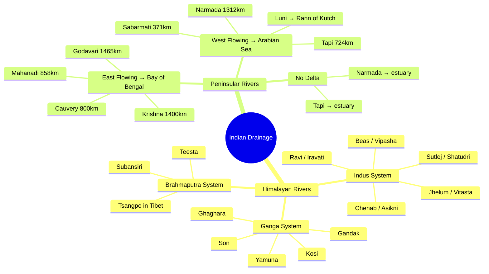

# Drainage System of India

## Part 1: Introduction

### Definition
A **drainage system** (or river system) is the pattern formed by streams, rivers, and lakes in a particular drainage basin. India's drainage system is shaped by its geological history, nature of rocks, slope of land, and climatic conditions.

### Significance for TSLPRB
- **28 verified PYQs** across Constable + SI papers (2015–2023) - one of the highest-frequency Geography subtopics
- Questions cover: river tributaries, dam/project matching, river origins, doab identification, waterfall-river matching, Godavari basin, and peninsular drainage patterns
- Most-tested rivers: **Godavari** (8+ Qs), **Narmada** (5+ Qs), **Krishna** (4+ Qs)
- Expect 2–3 direct drainage questions per paper

---

## Part 2: Deep Dive

### Classification of Indian Rivers

Indian rivers are classified into two major groups based on their origin:

#### A. Himalayan Rivers
- **Origin:** Glaciers and snow-fed sources in the Himalayas
- **Nature:** Perennial (flow year-round), long courses, deep valleys in upper reaches
- **Major systems:** Indus, Ganga, Brahmaputra

##### 1. The Indus System
- **Origin:** Near Lake Mansarovar, Tibet (flows through Ladakh → Pakistan)
- **Total length:** 2,880 km (709 km in India)
- **Key tributaries:** Jhelum, Chenab, Ravi, Beas, Sutlej (Panjnad system)
- **Doabs (inter-river plains):**
  - **Bist Doab** - between Beas and Sutlej
  - **Bari Doab** - between Beas and Ravi
  - **Rechna Doab** - between Ravi and Chenab
  - **Chaj Doab** - between Chenab and Jhelum
- **Ancient names:** Ravi = Iravati (परुष्णी), Jhelum = Vitasta, Chenab = Asikni, Beas = Vipasha, Sutlej = Shatudri
- ⚡ **PYQ Alert:** "Which river is also known as Iravati?" → Ravi

##### 2. The Ganga System
- **Origin:** Gangotri Glacier (as Bhagirathi) → joins Alaknanda at Devprayag → becomes Ganga
- **Total length:** 2,525 km
- **Key tributaries:**
  - Left bank: Ramganga, Gomti, Ghaghara, Gandak, **Kosi**, Mahananda
  - Right bank: Yamuna, Son, Damodar
- **Delta:** Sundarban Delta - largest river delta in the world
- ⚡ **PYQ Alert:** "Bhakra-Nangal project is on which river?" → Sutlej (technically Indus system, tested in drainage context)

##### 3. The Brahmaputra System
- **Origin:** Near Lake Mansarovar, Tibet
- **Names across regions:** Tsangpo (Tibet) → Dihang (Arunachal Pradesh) → Brahmaputra (Assam)
- **Total length:** 2,900 km (916 km in India)
- **Key tributaries:** Subansiri, Teesta, Manas, Lohit
- **Nature:** Antecedent river (older than the Himalayas - cuts through them)
- ⚡ **PYQ Alert:** "Brahmaputra is an antecedent river / called Tsangpo in Tibet" - direct PYQ

#### B. Peninsular Rivers
- **Origin:** Western Ghats, Central Highlands
- **Nature:** Mostly seasonal (rain-fed), shorter courses, shallower valleys
- **Key feature:** Most peninsular rivers flow **west to east** into the Bay of Bengal

##### East-Flowing Rivers (into Bay of Bengal)

| River | Origin | Length (km) | Key Tributaries | States | Delta? |
|-------|--------|-------------|----------------|--------|--------|
| **Godavari** | Nasik, Maharashtra | 1,465 | Pranahita, Indravati, Sabari, Manjira, **Wainganga**, Penganga, Kinnerasani | 7 states (MH, TS, AP, CG, MP, KA, OR) | Yes - 2nd largest in India |
| **Krishna** | Mahabaleshwar, WG | 1,400 | Bhima, Tungabhadra, **Malaprabha**, Ghataprabha, Musi, Panchganga | MH, KA, TS, AP | Yes |
| **Cauvery** | Brahmagiri Hills, Coorg | 800 | Hemavati, Shimsha, Arkavati, Kabini | KA, TN, KL | Yes (Srirangapatna delta) |
| **Mahanadi** | Sihawa, Chhattisgarh | 858 | Seonath, Hasdeo, Mand, Ib, Jonk | CG, OR, JH | Yes |

- ⚡ **PYQ Alert:** "Easternmost tributary of Godavari?" → **Sabari** (not Indravati - common trap)
- ⚡ **PYQ Alert:** "Number of states in Godavari catchment area?" → **7**
- ⚡ **PYQ Alert:** "Which is NOT a tributary of Krishna?" → **Purna** and **Pravara** (they're Godavari tributaries, not Krishna)

##### West-Flowing Rivers (into Arabian Sea)

| River | Origin | Length (km) | Key Feature |
|-------|--------|-------------|-------------|
| **Narmada** | Amarkantak Plateau, MP | 1,312 | Flows through a **rift valley** between Vindhyas (south) and Satpuras (north) |
| **Tapi (Tapti)** | Multai, Betul, MP | 724 | Also flows through a rift valley; parallel to Narmada |
| **Sabarmati** | Aravalli Hills, Rajasthan | 371 | Flows through Gujarat to Gulf of Khambhat |
| **Luni** | Pushkar Valley, Aravallis | 495 | Ends in the **Rann of Kutch** (inland drainage - doesn't reach sea) |
| **Mahi** | Vindhya Range, MP | 583 | Flows into Gulf of Khambhat |

- ⚡ **Key fact:** West-flowing peninsular rivers (Narmada, Tapi) have **no deltas** - they form estuaries because rift valley rivers flow faster
- ⚡ **PYQ Alert:** "Luni river ends in...?" → Rann of Kutch
- ⚡ **PYQ Alert:** "Narmada flows in a rift valley / is west-flowing" - direct assertion-reason PYQ
- ⚡ **PYQ Alert:** "Marble Water Falls (Dhuandhar Falls) - which river?" → Narmada

### River Projects & Dams (Heavily Tested)

| Dam/Project | River | State |
|-------------|-------|-------|
| **Bhakra-Nangal** | Sutlej | HP/Punjab |
| **Sardar Sarovar** | Narmada | Gujarat |
| **Ukai** | Tapi | Gujarat |
| **Matatilla** | Betwa | UP |
| **Sriram Sagar** | Godavari | Telangana (Nizamabad) |
| **Lower Manair** | Manair (Godavari tributary) | Telangana (Karimnagar) |
| **Kadam** | Kadam (Godavari tributary) | Telangana (Adilabad) |
| **Rajoli Banda** | Tungabhadra | Telangana (Mahabubnagar) |
| **Kaleshwaram** | Godavari | Telangana |
| **Jayakwadi** | Godavari | Maharashtra |
| **Hirakud** | Mahanadi | Odisha |
| **Tehri** | Bhagirathi | Uttarakhand |
| **Dul-Hasti** | Chenab | J&K |
| **Salal** | Chenab | J&K |

- ⚡ **PYQ Trap:** "Salal project - which river?" → **Chenab** (NOT Tapi - the 2018 Prelims question asked which pair is WRONG, and Salal-Tapi was the wrong pair)

### Waterfalls & Rivers

| Waterfall | River |
|-----------|-------|
| **Jog (Gersoppa)** | Sharavathy |
| **Dudhsagar** | Mandovi |
| **Dhuandhar (Marble Falls)** | Narmada |
| **Hogenakal** | Cauvery |
| **Kapildhara** | Narmada |

### River Interlinking
- India's National River Linking Project (NRLP) aims to connect surplus basins with deficit basins
- **Ken-Betwa Link** - first project, Phase 1 began 2023
- Connects peninsular and Himalayan river systems
- ⚡ Tested in 2018 Mains: "Integration of rivers"

### Godavari Water Disputes Tribunal
- Headed by Justice Bachawat
- Constituted to settle water-sharing between Maharashtra, AP (now Telangana), Karnataka, Madhya Pradesh, Odisha
- ⚡ **Direct PYQ** in SI 2023 Mains

---

## Part 3: Visual Map

### Mermaid Mind Map



### Text Hierarchy

```
Indian Drainage System
├── Himalayan Rivers (perennial, glacier-fed)
│   ├── Indus System → 5 tributaries (JRCBS)
│   ├── Ganga System → largest basin in India
│   └── Brahmaputra → antecedent, Tsangpo
├── Peninsular Rivers (seasonal, rain-fed)
│   ├── East-flowing (deltas): Godavari > Krishna > Mahanadi > Cauvery
│   └── West-flowing (estuaries): Narmada, Tapi, Sabarmati, Luni
├── Dams/Projects → match river + state
└── Disputes → Godavari Tribunal (Bachawat)
```

---

## Part 4: Data & Comparisons

### Major Rivers - Quick Reference Table

| River | Origin | Length | Drains Into | States | Key Fact |
|-------|--------|--------|-------------|--------|----------|
| Ganga | Gangotri Glacier | 2,525 km | Bay of Bengal | UK, UP, BR, WB, JH | Largest basin in India |
| Brahmaputra | Tibet (Mansarovar) | 2,900 km | Bay of Bengal | AR, AS, WB | Antecedent river |
| Godavari | Nasik, MH | 1,465 km | Bay of Bengal | 7 states | "Dakshin Ganga" |
| Krishna | Mahabaleshwar | 1,400 km | Bay of Bengal | MH, KA, TS, AP | 2nd largest peninsular |
| Narmada | Amarkantak | 1,312 km | Arabian Sea | MP, MH, GJ | Rift valley, no delta |
| Tapi | Multai, Betul | 724 km | Arabian Sea | MP, MH, GJ | Parallel to Narmada |
| Cauvery | Brahmagiri Hills | 800 km | Bay of Bengal | KA, TN, KL | Sacred river of South |
| Mahanadi | Sihawa, CG | 858 km | Bay of Bengal | CG, OR | Hirakud Dam |
| Luni | Pushkar Valley | 495 km | Rann of Kutch | RJ, GJ | Only inland drainage |

### Doab Reference (SI Prelims Favorite)

| Doab | Between Rivers |
|------|---------------|
| Bist | Beas - Sutlej |
| Bari | Beas - Ravi |
| Rechna | Ravi - Chenab |
| Chaj | Chenab - Jhelum |
| Sindh Sagar | Jhelum - Indus |

---

## Part 5: Memory Hacks

### Mnemonic for Peninsular East-Flowing Rivers (longest to shortest)

**"God KriMa Cau"** - Godavari (1,465) → Krishna (1,400) → Mahanadi (858) → Cauvery (800)

### Mnemonic for Indus Tributaries

**"J C R B S"** - Jhelum, Chenab, Ravi, Beas, Sutlej (west to east)

### Mnemonic for Doabs

**"BCR CC"** - Bist, Bari, Rechna, Chaj, (sindh sagar) - maps to rivers east→west

### ELI5 Analogy

> Think of India's drainage like a **tilted table**: the Western Ghats form the high edge on the west side. Pour water on the table - most of it runs east toward the Bay of Bengal (that's why most peninsular rivers flow east). Only two rivers - Narmada and Tapi - found **cracks in the table** (rift valleys) that let them escape westward to the Arabian Sea. And one rebel river, Luni, just gives up halfway and evaporates into the Rann of Kutch - it never reaches any sea at all.

---

## Part 6: PYQs

### Real TSLPRB Questions

**Q1.** [Constable 2018 Prelims, Q92] Which of the following is the easternmost tributary of the Godavari river system?
(1) Pranahita
(2) Sabari
(3) Kinnerasani
(4) Indravati

**Q2.** [Constable 2018 Prelims, Q115] The number of states at present which fall in the catchment area of Godavari river:
(1) 8
(2) 7
(3) 4
(4) 5

**Q3.** [Constable 2018 Mains, Q89] Matatilla Project was built on which of the following rivers?
(1) Mahanadi
(2) Kosi
(3) Betwa
(4) Damodar

**Q4.** [Constable 2022 Prelims, Q192] Ukai dam is situated across which of the following rivers?
(1) Tapi
(2) Narmada
(3) Kaveri
(4) Chambal

**Q5.** [SI 2018 Prelims, Q158] Read the following statements:
(a) River Narmada flows in a rift valley.
(b) Vindhya mountains are located to the south of river Narmada.
(c) River Narmada is a west flowing river.
Which of the above statement/s is/are correct?
(1) (a) and (c) only
(2) (a), (b) and (c)
(3) (b) and (c) only
(4) (a) only

### Answers
| Q | Answer | Explanation |
|---|--------|-------------|
| 1 | **(2) Sabari** | Sabari is the easternmost tributary; Indravati is further west despite being the largest |
| 2 | **(2) 7** | MH, TS, AP, CG, MP, KA, OR |
| 3 | **(3) Betwa** | Matatilla multipurpose project is on the Betwa river in UP |
| 4 | **(1) Tapi** | Ukai Dam is on the Tapi river in Gujarat |
| 5 | **(1) (a) and (c) only** | Vindhyas are to the NORTH of Narmada, not south - (b) is wrong |
